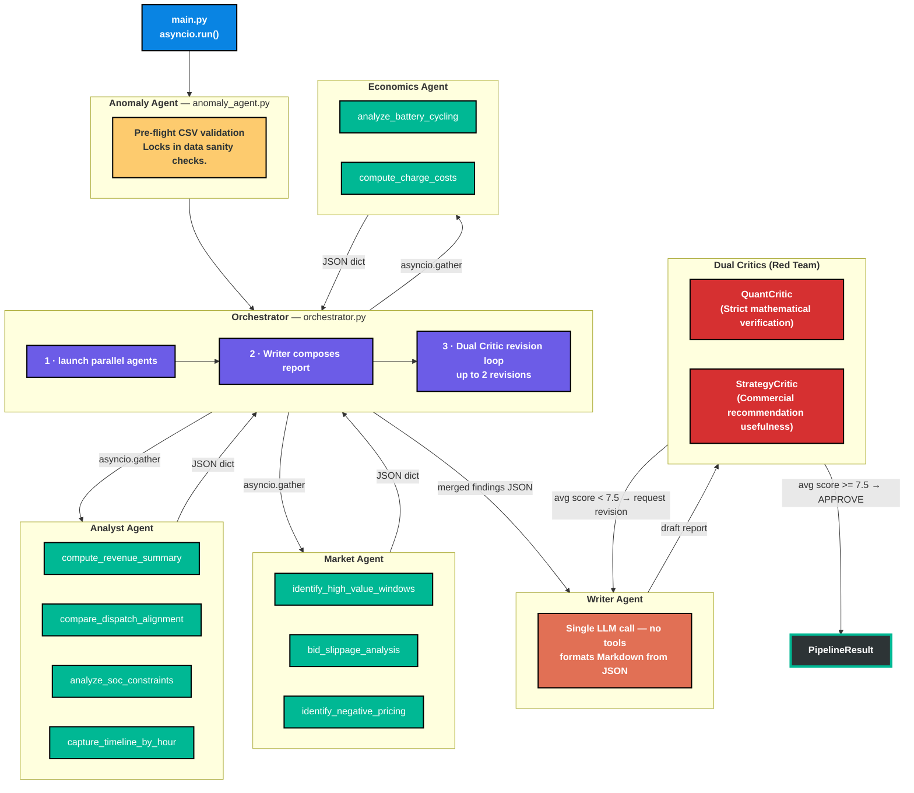
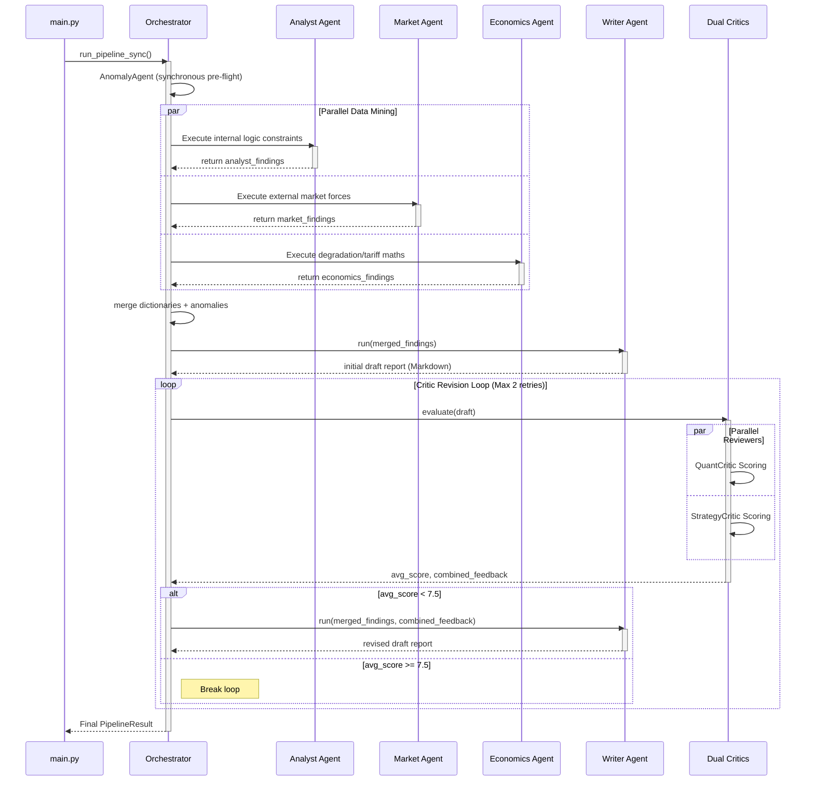

# Battery Decision Support Agent


An LLM-powered **multi-agent system** that analyses battery storage performance data and produces actionable trading recommendations.

The system compares **Historical** operation against **Perfect Foresight** to quantify the revenue gap, identify what drove it, and generate grounded recommendations — entirely through structured tool calls. The LLM never reads raw data.

---

## Quick Start

```bash
# 1. Install dependencies
pip install -r requirements.txt

# 2. Set API credentials
cp .env.example .env
# Edit .env — fill in OPENROUTER_API_KEY (or OPENAI_API_KEY) and MODEL

# 3. Run
python main.py data/EXAMPLE_BATTERY_DATA.csv
```

The Markdown report is written to `output/report_<BATTERY>_<DATE>.md` and printed to stdout.

### CLI flags

| Flag | Default | Description |
|------|---------|-------------|
| `--output PATH` | `output/report_*.md` | Custom report path |
| `--quiet` | off | Suppress per-agent trace |
| `--max-revisions N` | `2` | Max Writer revisions the Critic can trigger |
| `--approval-threshold X` | `7.5` | Critic score (0–10) needed to approve |

---

## Sample Output

Generated reports follow a strict Markdown format enforcing clear, data-dense trader takeaways:

```markdown
# 🔋 Trader Dispatch Analysis
**Date:** 2026-04-03
**Critic Approval Score:** 9.00/10

### Executive Financial Summary
* **Revenue Gap:** **$1,000,000.00 (50.0%)** left on the table compared to perfect foresight.
* **Primary Driver:** Suboptimal SOC during high-price clearing intervals. The battery maintained only **15.00 MWh** natively during evening peak blocks vs **75.00 MWh** required.

### Actionable Directives
1. **Capacity Protection:** Maintain a minimum 100 MWh SOC floor exclusively from 17:00-21:30.
2. **Forecast Recalibration:** Implement a +$500/MWh positive bias correction targeting MAPE <35%.
```

---

## System Architecture

Six specialised agents coordinated by an **Orchestrator**:



---

## Critic Revision Loop

Evaluation is **inside** the pipeline, not a post-hoc script. Every report is reviewed before the user sees it.



The Critic runs two checks independently:

1. **Deterministic grounding** — regex extracts all numbers from the report and compares them to the findings dict within 2% tolerance. No LLM needed.
2. **LLM quality score** — rates recommendation specificity, driver accuracy, and trader usefulness 0–10. Generates a targeted `revision_request` if any dimension falls short.

---

## Agent Responsibilities

| Agent | File | Tools | Returns |
|-------|------|-------|---------|
| **Anomaly** | `anomaly_agent.py` | Built-in Pandas checks | `anomaly_findings` dict |
| **Analyst** | `analyst_agent.py` | `compute_revenue_summary` `compare_dispatch_alignment` `analyze_soc_constraints` `capture_timeline_by_hour` | `analyst_findings` dict |
| **Market** | `market_agent.py` | `identify_high_value_windows` `bid_slippage_analysis` `identify_negative_pricing` | `market_findings` dict |
| **Economics** | `economics_agent.py` | `analyze_battery_cycling` `compute_charge_costs` | `economics_findings` dict |
| **Writer** | `writer_agent.py` | None | Markdown report string |
| **Critic (x2)** | `critic_agents.py` | None | `CriticResult` with score + revision |
| **Orchestrator** | `orchestrator.py` | Coordinates all | `PipelineResult` |

---

## Data Tools

All 9 tools live in `tools/`. They return compact JSON summaries — the LLM never sees raw CSV rows.

| Tool | Focus | 
|------|-------|
| `compute_revenue_summary` | What is the total revenue gap and %? |
| `compare_dispatch_alignment` | How did charge/discharge behaviour differ between scenarios? |
| `analyze_soc_constraints` | Was the battery at the wrong SOC when prices spiked? |
| `capture_timeline_by_hour` | High-fidelity mapping of operational behaviour. |
| `identify_high_value_windows` | Which specific market events caused the biggest losses? |
| `bid_slippage_analysis` | How much value was lost purely due to market constraints? |
| `identify_negative_pricing` | How did the battery respond when prices fell below $0? |
| `analyze_battery_cycling` | What was the equivalent full cycle degradation? |
| `compute_charge_costs` | How much did we pay in charging tariffs? |

---

## Project Structure

```
agentic-battery-trader/
├── agent/
│   ├── agent.py            # _react_loop() shared helper + legacy run_agent()
│   ├── prompts.py          # Per-agent system prompts (Analyst, Market, Writer, Critic)
│   ├── tools.py            # 6 data analysis tools + load_and_validate()
│   ├── anomaly_agent.py    # Anomaly: Deterministic CSV validation
│   ├── analyst_agent.py    # Analyst: 4 tools → JSON metrics dict
│   ├── market_agent.py     # Market: 3 tools → JSON pricing dict
│   ├── economics_agent.py  # Economics: 2 tools → JSON degradation dict
│   ├── writer_agent.py     # Writer: single LLM call → Markdown
│   ├── critic_agents.py    # Dual Critics: Quant and Strategy LLM evaluators
│   └── orchestrator.py     # Orchestrator: asyncio parallel + revision loop
├── data/                   # CSV input (gitignored)
├── output/                 # Generated reports (gitignored)
├── tests/
│   └── test_tools.py       # 19 unit tests for all 6 data tools
├── main.py                 # CLI entry point
├── DESIGN_SPEC.md          # Agent contracts, schema, success criteria
├── requirements.txt
└── .env.example
```

---

## Example Q&A

These are the questions a battery trader would ask — and how the agent answers them using its tool pipeline.

---

### Q1: How much revenue did we leave on the table?

**Trader asks:** *"What was our total revenue gap vs. perfect foresight this week?"*

**How the agent answers:**
The Analyst Agent calls `compute_revenue_summary` as its first tool. The tool aggregates all `cleared` rows across both scenarios and returns:

```json
{
  "historical_revenue": 1000000.00,
  "perfect_revenue":    2000000.00,
  "gap_abs":            1000000.00,
  "gap_pct":            50.0,
  "interval_count":     288
}
```

The Writer uses these exact numbers in the financial summary table. The Critic verifies them against the tool output within 2% before approving.

**Report section produced:**

| Metric | Value |
|--------|-------|
| Historical Revenue | $1,000,000.00 |
| Perfect Revenue | $2,000,000.00 |
| Revenue Gap | **$1,000,000.00 (50.0%)** |
| Intervals Analysed | 288 |

---

### Q2: Why did we underperform — what was the main reason?

**Trader asks:** *"Was our underperformance mainly a timing problem, an SOC problem, or a forecasting problem?"*

**How the agent answers:**
The Analyst Agent calls three tools in sequence to test each hypothesis:

1. `analyze_soc_constraints` → Historical SOC at the top-10 price spikes averaged **15.00 MWh** vs Perfect's **75.00 MWh**. The battery was at minimum SOC **30.00%** of all intervals.
2. `compare_dispatch_alignment` → **20 direction conflicts** (5.0% of intervals) where Historical charged while Perfect discharged, costing **−$50,000**.
3. `capture_timeline_by_hour` → Historical discharged 400 MWh vs Perfect's 500 MWh — the battery was underutilised during peaks.

The agent synthesises: the primary driver is **SOC depletion before peak windows**, not timing conflicts (which were a smaller secondary factor).

**Report section produced:**

> **Primary Driver: Suboptimal SOC during high-price intervals**
>
> Historical SOC at the top-10 price spikes averaged only 15.00 MWh, versus Perfect's 75.00 MWh.
> The battery was at minimum SOC 30.00% of all intervals — unable to discharge when prices hit
> $20,000/MWh at 20:30, missing $350,000 in that single interval alone.

---

### Q3: Was the price forecast the problem?

**Trader asks:** *"Did the forecast lead us to make the wrong dispatch decisions?"*

**How the agent answers:**
The Market Agent calls `bid_slippage_analysis`:

```json
{
  "mape":              40.00,
  "mean_error":       -500.00,
  "pct_underforecast": 50.00,
  "correlation":       0.90
}
```

A mean error of **−$500/MWh** means the model systematically predicted prices too low. 50.00% of intervals were underforecasts — which caused the battery to dispatch early at moderate prices, leaving it empty when the $20,000+ spike arrived.

**Report section produced:**

> **Secondary Factor: Systematic price forecast under-bias (MAPE 40.00%, 50.00% underforecast)**
>
> The forecast consistently under-predicted prices by ~$500/MWh on average, causing early
> discharge that depleted SOC before the evening spike window.

---

### Q4: What should we do differently tomorrow?

**Trader asks:** *"Give me two concrete things I can change in operations."*

**How the agent answers:**
The Writer Agent receives the merged findings and must follow a strict recommendation format: action, rationale, expected benefit, tradeoff — with specific numbers drawn from the findings.

**Report section produced:**

**Recommendation 1 — Protect SOC for the evening peak window**

| | |
|---|---|
| **Action** | Maintain minimum 100 MWh SOC from 17:00–21:30. Use the morning charging window (when prices are below $100/MWh) to pre-fill. |
| **Rationale** | Historical SOC at the top-10 price events averaged 15.00 MWh. Perfect Foresight held 75.00 MWh at those same moments. The entire $1.0M gap concentrates in this window. |
| **Expected Benefit** | Recover an estimated ~$500K of the gap by being available to discharge during $1,000–$20,000/MWh events. |
| **Tradeoff** | Requires holding capacity in reserve, reducing revenue from midday moderate-price opportunities. |

**Recommendation 2 — Re-calibrate the forecast model to correct the under-bias**

| | |
|---|---|
| **Action** | Add a +$500/MWh bias correction term to all forecasts. Target MAPE below 35% and underforecast rate below 40%. |
| **Rationale** | Mean forecast error of −$500.00/MWh caused the battery to treat evening peaks as moderate-price windows and dispatch early. |
| **Expected Benefit** | Improved dispatch decisions during high-volatility periods; better alignment between planned bids (expected) and cleared outcomes. |
| **Tradeoff** | Over-correction risks charging too aggressively, increasing battery degradation and missing low-price charging windows. |

---

### Q5: How do I know the report numbers are accurate?

**Trader asks:** *"Can I trust these figures, or is the AI making them up?"*

**How the agent answers:**
Every number in the report passes through the Dual Critics' **deterministic grounding check** before the report is delivered. The check extracts all numeric values from the report text and compares them to the tool output dicts within 2% tolerance. Any number that cannot be traced to a tool output triggers a revision request back to the Writer.

**Grounding provenance for the example report:**

| Claim in report | Source tool | Status |
|----------------|-------------|--------|
| Gap = $1,000,000.00 (50.0%) | `compute_revenue_summary` | ✓ verified |
| Hist SOC at spikes = 15.00 MWh | `analyze_soc_constraints` | ✓ verified |
| Perfect SOC at spikes = 75.00 MWh | `analyze_soc_constraints` | ✓ verified |
| Missed $350,000 at 20:30 | `identify_high_value_windows` | ✓ verified |
| MAPE = 40.00% | `bid_slippage_analysis` | ✓ verified |
| Mean forecast error = −$500.00/MWh | `bid_slippage_analysis` | ✓ verified |
| 50.00% underforecast | `bid_slippage_analysis` | ✓ verified |
| 20 direction conflicts | `compare_dispatch_alignment` | ✓ verified |

---

## Expected Data Schema

The system generalises to any CSV matching this schema — no code changes required.

| Column | Type | Description |
|--------|------|-------------|
| `SCENARIO_NAME` | string | `historical` or `perfect` |
| `SCHEDULE_TYPE` | string | `expected` or `cleared` |
| `START_DATETIME` | datetime | Interval start (local time) |
| `SOC` | float | State of charge at end of interval (MWh) |
| `CHARGE_ENERGY` | float | Energy charged (MWh ≥ 0) |
| `DISCHARGE_ENERGY` | float | Energy discharged (MWh ≥ 0) |
| `PRICE_ENERGY` | float | Cleared energy price ($/MWh) |
| `REVENUE` | float | Revenue from energy market ($) |

---

## Evaluation Framework

The Critic Agent rates every report on four dimensions before approving:

| Dimension | Method | Scale |
|-----------|--------|-------|
| **Grounding** | Deterministic (regex + tolerance check) | Pass / Fail per number |
| **Recommendation specificity** | LLM judge | 0–10 |
| **Driver accuracy** | LLM judge | 0–10 |
| **Trader usefulness** | LLM judge | 0–10 |

**Approval rule:** grounding passes AND average LLM score ≥ 7.5 / 10.  
If either fails, the Critic generates a targeted `revision_request` and the Writer revises (up to 2 times).

---

## Running Tests

```bash
python -m pytest tests/ -v
```

Unit tests cover `load_and_validate()` and all 9 data tools using synthetic DataFrames.

---

## Design Decisions

| Decision | Rationale |
|----------|-----------|
| **6-agent specialisation** | Analyst, Market, Economics run in parallel. Each has a smaller tool set and tighter context — less hallucination risk, faster execution. |
| **No raw data to LLM** | All 9 tools return compact JSON summaries. The LLM never sees individual rows. |
| **Structured findings dict, not Markdown** | Analyst and Market return dicts. Writer gets clean, parseable input. Critic can do deterministic number matching. |
| **Critic inside the loop** | Evaluation happens before the report is delivered. Bad drafts are revised automatically. |
| **Deterministic + LLM grounding** | Regex catches fabricated numbers deterministically; LLM judge catches reasoning failures that regex cannot. |
| **Schema-driven generalisation** | `load_and_validate()` uses dynamic column references. Drop in any conforming CSV and re-run — no code changes needed. |
